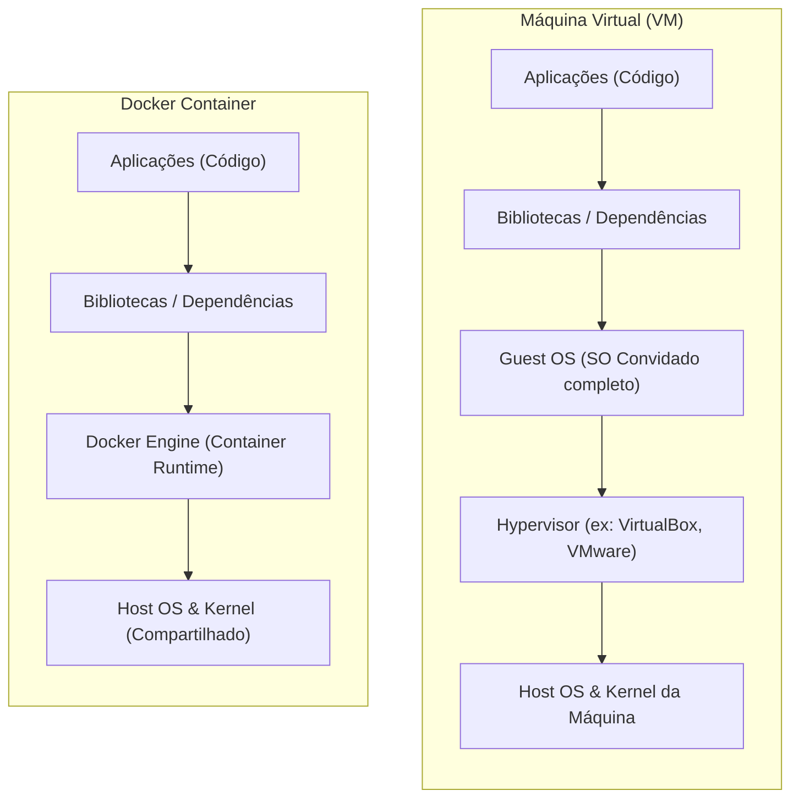
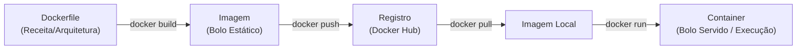

# 🐳 Learning Docker Lab

Seja bem-vindo ao **Learning Docker Lab**! Este repositório foi construído de forma 100% didática para ensinar o que é o Docker, como ele funciona sob o capô (namespaces, cgroups, kernel compartilhado) e por que ele revolucionou a forma como desenvolvemos e distribuímos software.

Além deste guia completo, este repositório contém um **Aplicativo Web Interativo (Guia Visual e Playground de Terminal)** que você pode rodar na sua própria máquina usando o próprio Docker!

---

## 📖 O que é Docker?

O **Docker** é uma plataforma de virtualização em nível de sistema operacional que permite empacotar uma aplicação junto com todas as dependências, bibliotecas e configurações necessárias para que ela funcione perfeitamente em qualquer ambiente. Esse pacote isolado e autossuficiente é chamado de **Container**.

### 🚨 O problema que ele resolve: "Na minha máquina funciona!"

Quem nunca passou pela frustração de desenvolver um software que roda perfeitamente na sua máquina local, mas falha miseravelmente ao ser implantado no servidor de produção? Isso geralmente ocorre por:
* Diferenças de versões do sistema operacional.
* Falta de bibliotecas ou dependências específicas instaladas no servidor.
* Conflitos de variáveis de ambiente.

O Docker resolve isso criando uma **paridade perfeita de ambientes**. Você configura o container uma única vez durante o desenvolvimento, e esse exato container (com as mesmas versões e arquivos) será executado em homologação, produção ou na nuvem.

---

## 🏗️ Como ele funciona por baixo do capô?

A grande mágica do Docker é ser **leve e performático**. Ao contrário das Máquinas Virtuais (VMs) tradicionais, o Docker não simula hardware físico nem roda um sistema operacional completo dentro de cada container. Ele **pega emprestado o Kernel do sistema hospedeiro (host)** e isola os processos usando recursos nativos do próprio Kernel Linux.

### 🔄 Máquinas Virtuais vs. Containers



### 🧱 Os Pilares da Virtualização Linux

Para delimitar o que cada container pode ver e usar do sistema operacional hospedeiro, o Docker utiliza dois recursos fundamentais do Kernel Linux:

1. **Namespaces (O Isolamento Visual)**:
   Define as "paredes" do container. O namespace isola o que o container consegue enxergar. Ele cria a ilusão de que o container é o único sistema operacional rodando na máquina.
   * **PID (Processos)**: O container possui sua própria tabela de processos. A aplicação principal roda como PID 1 (o processo pai), mesmo sendo apenas mais um PID comum na máquina host.
   * **NET (Rede)**: Cria interfaces de rede e portas isoladas para cada container.
   * **MNT (Pontos de Montagem)**: O container possui seu próprio sistema de arquivos isolado do host.
   * **UTS (Hostname)**: Nome de máquina específico para o container.
   * **USER (Usuários)**: Mapeamento de usuários locais e permissões isoladas.

2. **Control Groups / cgroups (O Limite de Recursos)**:
   Define os "tetos" de consumo de hardware. Evita que um container mal configurado ou sob ataque consuma todos os recursos da máquina física e derrube o servidor.
   * Limita a quantidade máxima de **CPU** atribuída ao container.
   * Limita o uso de **Memória RAM** (previne vazamentos de memória).
   * Controla a taxa de leitura/escrita no disco (I/O) e o uso de rede.

---

## 🧩 Conceitos Fundamentais do Docker

Para trabalhar com o Docker, você precisa dominar o seu ciclo de vida e seus 4 principais conceitos:



1. **Dockerfile**:
   É o "projeto arquitetônico" ou a "receita de bolo" da sua aplicação. É um arquivo de texto declarativo contendo instruções passo a passo para construir a infraestrutura do seu app (instalar pacotes, copiar arquivos de código, abrir portas de rede, definir comando de inicialização).

2. **Imagem**:
   É o "bolo congelado". Uma imagem é um arquivo estático e somente leitura (read-only) gerado a partir da compilação do Dockerfile. Ela contém o código fonte, bibliotecas, ferramentas de sistema e tudo o que a aplicação precisa para rodar. As imagens são compostas por **camadas empilháveis** para otimizar espaço em disco.

3. **Registro (Registry)**:
   É o "supermercado de imagens". Um local centralizado para armazenar e compartilhar imagens Docker. O mais famoso e público é o **Docker Hub**, mas grandes nuvens possuem seus próprios registros privados (como AWS ECR, Google Artifact Registry).

4. **Container**:
   É o "bolo servido e pronto para comer". Um container é a instância física em execução de uma imagem. Você pode criar, iniciar, parar, mover ou deletar um container com comandos simples. Ele é o ambiente vivo e dinâmico onde sua aplicação de fato executa.

---

## 🚀 Como Rodar o Laboratório Interativo Localmente

Para praticar esses conceitos visualmente, criamos uma aplicação web educativa com um simulador de namespaces/cgroups e um terminal Docker interativo.

### Pré-requisitos
Você precisa ter o **Docker** e o **Docker Compose** instalados na sua máquina.

### Executando com o Docker Compose (Recomendado)

1. Clone ou acesse este diretório no seu terminal.
2. Inicie o laboratório rodando o seguinte comando:
   ```bash
   docker compose up -d
   ```
3. O Docker irá compilar a imagem local e subir o servidor Web. Assim que terminar, acesse no seu navegador:
   👉 **[http://localhost:8080](http://localhost:8080)**

### Parando o Laboratório
Para parar a execução e liberar as portas da sua máquina hospedeira, execute:
```bash
docker compose down
```

---

## 🛠️ Comandos Docker Úteis Utilizados no Lab

Aqui estão os comandos fundamentais do Docker para você treinar no seu terminal real:

* **Primeiro teste do Docker (baixa uma imagem leve de teste e a executa)**:
  ```bash
  docker run hello-world
  ```
* **Construir uma imagem a partir de um Dockerfile**:
  ```bash
  docker build -t nome-da-imagem .
  ```
* **Listar imagens baixadas ou construídas na máquina**:
  ```bash
  docker images
  ```
* **Executar um container em segundo plano (detached) mapeando portas**:
  ```bash
  docker run -d -p 8080:80 --name nome-do-container nome-da-imagem
  ```
* **Executar um container interativo do Ubuntu com shell Bash**:
  ```bash
  docker run -it ubuntu bash
  ```
* **Listar containers ativos**:
  ```bash
  docker ps
  ```
* **Listar todos os containers (ativos e parados)**:
  ```bash
  docker ps -a
  ```
* **Parar um container em execução**:
  ```bash
  docker stop nome-do-container
  ```
* **Parar e limpar os containers criados pelo Docker Compose**:
  ```bash
  docker compose down
  ```
* **Deletar um container parado**:
  ```bash
  docker rm nome-do-container
  ```