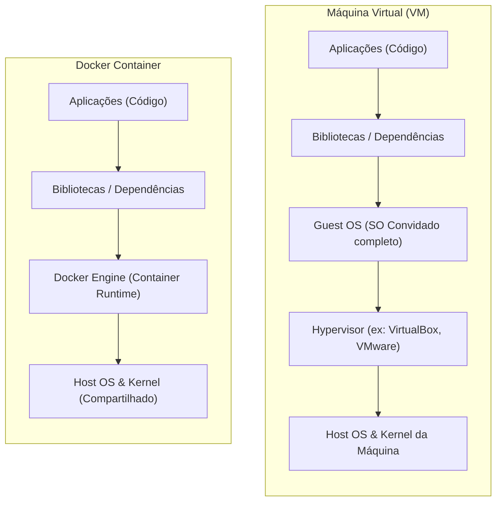
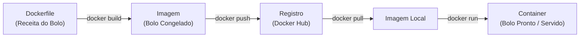

# 🐳 Aprendendo Docker: Guia Didático Completo

Seja bem-vindo ao **Guia Didático do Docker**! Este repositório foi criado especificamente para ensinar o que é o Docker, como ele funciona de verdade sob o capô, como escrever seus próprios arquivos de configuração e como interagir com containers através do terminal.

---

## 📖 O que é Docker?

O **Docker** é uma plataforma de virtualização em nível de sistema operacional (OS) que permite empacotar uma aplicação e todas as suas dependências em uma unidade isolada chamada **Container**.

### 🚨 O Problema: "Na minha máquina funciona!"
Antes do Docker, era muito comum um sistema rodar perfeitamente na máquina de um desenvolvedor, mas apresentar falhas graves ao ser implantado no servidor de produção. Isso ocorria devido a discrepâncias nas versões do sistema operacional, bibliotecas ausentes ou conflitos de portas e variáveis de ambiente.

O Docker extingue esse problema ao unificar o empacotamento da infraestrutura e do código. Se o container rodou localmente, ele rodará exatamente da mesma forma em qualquer servidor de homologação, produção ou nuvem.

---

## 🏗️ Como ele funciona por baixo do capô?

A grande força do Docker reside na sua **leveza e performance**. Ao contrário das Máquinas Virtuais (VMs) tradicionais, o Docker **não simula hardware físico nem roda sistemas operacionais (Kernels) completos** dentro de cada container. Os containers compartilham o próprio Kernel do sistema operacional hospedeiro (host) e apenas isolam seus processos e recursos utilizando funcionalidades do Kernel Linux:

### 🔄 Máquinas Virtuais vs. Containers



### 🧱 Os Pilares do Isolamento Linux

1. **Namespaces (Isolamento de Visão)**:
   Funciona como as "paredes" do container. O namespace isola o que o container consegue ver do sistema operacional.
   * **PID**: Isola o ID de processos. A aplicação principal do container roda como PID 1 (processo pai), mesmo sendo apenas mais um processo comum na tabela do host.
   * **NET**: Fornece ao container suas próprias interfaces de rede, IPs e tabela de portas.
   * **MNT**: Cria um sistema de arquivos montado isolado. O container não acessa arquivos do host a menos que seja explicitamente mapeado.
   * **UTS**: Permite ao container ter seu próprio hostname (nome da máquina).
   * **USER**: Permite mapear e isolar IDs de usuários e permissões.

2. **Control Groups / cgroups (Limite de Recursos)**:
   Funciona como o "teto" do container. Impede que um container consuma todo o hardware do host.
   * Limita o consumo máximo de **CPU**.
   * Limita o uso de **Memória RAM** (evitando travamentos no host por falta de memória).
   * Delimita largura de banda de rede e velocidade de escrita/leitura em disco (I/O).

---

## 🧩 Ciclo de Vida e Conceitos Fundamentais

Para compreender o funcionamento do Docker, você deve conhecer a relação entre os seus quatro componentes principais:



1. **Dockerfile**: Um arquivo de texto declarativo com instruções passo a passo para construir a infraestrutura do seu app (como instalar dependências, compilar o código e expor portas).
2. **Imagem**: Um arquivo estático, somente leitura, gerado a partir do Dockerfile. Ela contém todo o sistema de arquivos necessário para que a aplicação execute. É organizada em camadas empilháveis.
3. **Registro (Registry)**: O servidor onde as imagens são publicadas e compartilhadas. O mais famoso é o **Docker Hub**.
4. **Container**: A instância em execução (viva e dinâmica) de uma imagem Docker.

---

## 🌎 Procurando e Executando Imagens do Docker Hub

O **Docker Hub** é o repositório público oficial onde comunidades e empresas disponibilizam imagens prontas (Node, Python, PostgreSQL, Nginx, Ubuntu, etc.).

### 1. Como procurar imagens no terminal
Você pode pesquisar por imagens prontas diretamente no seu terminal com o comando `docker search`:
```bash
docker search nginx
```
Isso listará as imagens mais populares contendo o servidor web Nginx, indicando se são oficiais e a quantidade de estrelas (curtidas).

### 2. Rodando sua primeira imagem: O Hello-World
O teste clássico para validar se o Docker está instalado corretamente:
```bash
docker run hello-world
```
**O que acontece por trás?**
1. O Docker CLI solicita ao Daemon para rodar o container a partir da imagem `hello-world`.
2. O Daemon procura a imagem localmente. Como não a encontra, ele realiza o download (`docker pull`) direto do Docker Hub.
3. Ele instancia o container, que imprime uma mensagem didática de sucesso no terminal e encerra a execução imediatamente.

### 3. Executando um servidor Nginx permanente
Para rodar um servidor web acessível pelo seu navegador:
```bash
docker run -d -p 8080:80 --name meu-servidor nginx
```
* O Nginx sobe em segundo plano (`-d`).
* A porta `8080` do seu computador físico é direcionada para a porta interna `80` do container (`-p 8080:80`).
* Abra **[http://localhost:8080](http://localhost:8080)** no seu navegador e você verá a tela de boas-vindas do Nginx.

### 4. Entrando em um terminal Ubuntu dentro do container
Você pode subir um sistema operacional limpo de forma instantânea e interagir diretamente com ele:
```bash
docker run -it ubuntu bash
```
* `-it`: Aloca um terminal interativo conectado à entrada do seu teclado.
* `bash`: Executa o terminal Bash padrão do Ubuntu.
* Seu prompt mudará para algo como `root@a1b2c3d4e5f6:/#`. Lá dentro, você pode instalar pacotes reais como se estivesse em uma máquina virtual (ex: `apt update && apt install curl -y`).
* Digite `exit` para sair do container e retornar ao seu terminal hospedeiro.

---

## ✍️ Escrevendo Código Docker (Dicionário de Sintaxe)

Abaixo estão detalhados os principais comandos utilizados na escrita dos arquivos de configuração do Docker.

### 📜 1. O Arquivo Dockerfile
Responsável por criar a sua receita de imagem.

| Instrução | Exemplo de Uso | O que faz / Para que serve |
| :--- | :--- | :--- |
| **FROM** | `FROM node:18-alpine` | **Imagem base**. Especifica qual imagem servirá de alicerce para construir a sua. Toda receita Dockerfile deve iniciar com `FROM`. |
| **WORKDIR** | `WORKDIR /usr/src/app` | **Diretório de trabalho**. Cria e define o caminho de execução padrão dentro do container para os próximos comandos. |
| **COPY** | `COPY package*.json ./` | **Copia arquivos**. Transfere arquivos ou pastas locais para dentro do container. Útil para separar dependências do código fonte. |
| **RUN** | `RUN npm ci` | **Executa comandos no build**. Executa comandos do sistema durante a compilação da imagem (ex: instalar pacotes ou compilar código). |
| **ENV** | `ENV PORT=3000` | **Variáveis de ambiente**. Define variáveis internas acessíveis pela aplicação que podem ser sobrescritas no runtime. |
| **USER** | `USER node` | **Segurança**. Define com qual usuário do sistema o container executará (evita rodar como root por boas práticas). |
| **EXPOSE** | `EXPOSE 3000` | **Documentação**. Informa qual porta de rede o container escuta internamente. Serve puramente como metadado documental. |
| **VOLUME** | `VOLUME /data` | **Persistência**. Declara uma pasta interna que deve ser montada como volume externo, preservando dados fora do ciclo de vida do container. |
| **CMD** | `CMD ["node", "app.js"]` | **Comando padrão**. Define o comando principal que será executado quando o container iniciar (só deve existir um por Dockerfile). |
| **ENTRYPOINT**| `ENTRYPOINT ["nginx"]` | **Comando imutável**. Semelhante ao CMD, mas não pode ser facilmente sobrescrito ao executar o comando run no terminal. |

---

### 🎼 2. O Arquivo docker-compose.yml
Usado para gerenciar e subir múltiplos containers simultaneamente de forma orquestrada.

> [!IMPORTANT]
> **Regra do YAML**: Arquivos `.yml` são estritamente sensíveis à identação. Use sempre **espaços** para recuos (geralmente 2 ou 4 espaços por nível). **Nunca utilize tabulações (tecla TAB)**, pois o interpretador gerará erros de compilação.

| Propriedade | Exemplo de Uso | O que faz / Para que serve |
| :--- | :--- | :--- |
| **version** | `version: '3.8'` | Define a versão de especificação da sintaxe do Compose a ser utilizada. |
| **services** | `services:` | Inicia o bloco de declaração de todos os containers/serviços da aplicação. |
| **web-app** | `web-app:` | Nome do serviço customizado (também registrado na rede interna como domínio DNS). |
| **build** | `build: .` | Indica que a imagem deve ser gerada localmente a partir de um Dockerfile no caminho especificado. |
| **image** | `image: node-app:1.0` | Especifica o nome e a tag da imagem associada ao container. |
| **ports** | `ports:` | Inicia o bloco de mapeamento e redirecionamento de portas de rede. |
| `- "8080:3000"` | `- "8080:3000"` | Mapeia a porta `8080` física do Host para redirecionar à porta `3000` interna do container. |
| **environment**| `environment:` | Inicia o bloco de declaração de variáveis de ambiente injetadas no container. |
| `- DB_HOST=db`| `- DB_HOST=db` | Define uma chave/valor de variável para que o app localize outros serviços. |
| **volumes** | `volumes:` | Inicia o mapeamento de pastas compartilhadas (bind mounts) ou volumes persistentes. |
| `- .:/app` | `- .:/usr/src/app` | Monta a pasta atual local na pasta `/usr/src/app` do container (útil para desenvolvimento com hot-reload). |
| **restart** | `restart: unless-stopped` | Política de reinício automático se o container cair ou o Docker host reiniciar. |
| **networks** | `networks:` | Inicia a configuração das redes virtuais em que o container estará acoplado. |
| `- rede-app` | `- rede-app` | Associa o container a uma rede isolada específica compartilhada com outros containers. |

---

### 🙈 3. O Arquivo .dockerignore
Serve para acelerar o processo de build e proteger dados confidenciais, impedindo o envio de arquivos indesejados para a imagem.

| Padrão / Arquivo | Para que serve excluir? |
| :--- | :--- |
| `node_modules/` | Pasta de bibliotecas locais. Deve ser excluída pois o container rodará sua própria instalação limpa baseada no seu sistema operacional isolado. |
| `.git` | Histórico completo do repositório Git local. Sua exclusão reduz o tamanho final da imagem e evita vazamentos de logs de versionamento. |
| `*.log` | Arquivos de log gerados no desenvolvimento local que apenas ocupam espaço de armazenamento de forma inútil. |
| `.env` | Credenciais locais de desenvolvimento (senhas, tokens e chaves privadas). Nunca devem entrar na imagem para evitar falhas graves de segurança. |
| `Dockerfile` | O próprio arquivo de receita de imagem não é necessário para o runtime interno da aplicação. |
| `.dockerignore` | O arquivo de ignore também pode ser excluído da cópia final por organização interna. |

---

## 🛠️ Tabela Completa de Comandos Úteis do Docker

| Categoria | Comando | Descrição | Quando Usar |
| :--- | :--- | :--- | :--- |
| **Criação & Tag** | `docker build -t nome:tag .` | Constrói uma imagem baseada no Dockerfile local. | Ao criar novas versões da sua imagem. |
| **Criação & Tag** | `docker tag imagem novotag` | Cria um alias/marcação para uma imagem existente. | Antes de publicar a imagem em outro registro. |
| **Distribuição** | `docker login` | Autentica seu terminal no Docker Hub com usuário e senha. | Para poder enviar imagens aos registros públicos ou privados. |
| **Distribuição** | `docker push imagem:tag` | Envia a imagem local para o Docker Hub. | Ao publicar sua imagem pronta para deploy. |
| **Distribuição** | `docker pull imagem:tag` | Baixa uma imagem do Docker Hub para a sua máquina local. | Para atualizar ou testar imagens oficiais localmente. |
| **Execução** | `docker run -d -p 80:80 imagem` | Cria e inicia um container em segundo plano (detached) mapeando portas. | Para subir serviços como servidores ou bancos. |
| **Execução** | `docker run -it imagem bash` | Cria e inicia um container conectando seu terminal local a ele. | Para debugar ou testar comandos Linux dentro do container. |
| **Execução** | `docker start id_ou_nome` | Inicia um container que já foi criado anteriormente e está parado. | Para reativar containers já existentes. |
| **Interação** | `docker exec -it nome comando` | Executa um comando dentro de um container que já está ativo. | Para rodar scripts ou rodar bash no container ativo. |
| **Interação** | `docker logs -f nome` | Exibe os logs gerados na saída padrão do container em tempo real. | Para monitorar erros ou requisições na aplicação. |
| **Monitoramento** | `docker ps` | Exibe a lista de todos os containers ativos no momento. | Para checar quais serviços estão no ar. |
| **Monitoramento** | `docker ps -a` | Exibe a lista de todos os containers (ativos e parados). | Para achar containers antigos que pararam de rodar. |
| **Monitoramento** | `docker inspect id_ou_nome` | Retorna metadados completos em formato JSON de um container ou imagem.| Para checar redes, variáveis internas e configurações detalhadas. |
| **Monitoramento** | `docker stats` | Mostra consumo de memória, CPU e rede de cada container em tempo real.| Para analisar a performance e carga de trabalho. |
| **Limpeza** | `docker stop id_ou_nome` | Envia um sinal para parar graciosamente o container ativo. | Ao encerrar o uso de um serviço. |
| **Limpeza** | `docker rm id_ou_nome` | Exclui definitivamente um container (deve estar parado). | Para liberar recursos de containers que não serão mais usados. |
| **Limpeza** | `docker rmi nome_imagem` | Exclui uma imagem salva localmente da memória física. | Para liberar espaço em disco. |
| **Limpeza** | `docker system prune -a` | Remove todos os containers parados, redes não utilizadas e imagens órfãs.| Para fazer uma limpeza geral e liberar muito espaço em disco. |
| **Compose** | `docker compose up -d` | Cria e inicia todos os serviços declarados no compose em background. | Ao subir todo o ambiente de uma aplicação (ex: app + banco). |
| **Compose** | `docker compose down` | Para e remove todos os containers e redes criados pelo compose local. | Ao parar de trabalhar no projeto. |

---

## 🚩 Guia Completo de Flags Frequentes no Docker

As **flags** modificam o comportamento padrão de comandos de execução (`run`, `build`, etc.).

| Flag | Nome Completo | O que faz / Como atua | Exemplo de Uso |
| :--- | :--- | :--- | :--- |
| **`-d`** | Detached | Roda o container em segundo plano. O terminal fica livre após o comando. | `docker run -d nginx` |
| **`-p`** | Publish | Mapeia uma porta do host para uma porta do container (`host:container`). | `docker run -p 8080:80 nginx` |
| **`-i`** | Interactive | Mantém a entrada padrão (stdin) aberta para digitação no container. | `docker run -i ubuntu` |
| **`-t`** | TTY | Aloca um terminal virtual simulado conectando o seu prompt ao container. | `docker run -t ubuntu` |
| **`--name`** | Name | Atribui um nome legível personalizado para identificar o container. | `docker run --name meu-app node` |
| **`-v`** | Volume | Cria uma pasta compartilhada persistente entre o host e o container. | `docker run -v /host:/container alpine` |
| **`-e`** | Env | Define ou sobrescreve variáveis de ambiente dentro do container. | `docker run -e DB_PASS=123 mysql` |
| **`--rm`** | Auto-remove | Remove o container automaticamente do disco assim que ele parar de rodar.| `docker run --rm alpine ls` |
| **`-t`** (no build)| Tag | Define o nome e a tag de versão da imagem gerada pelo build. | `docker build -t app:1.0 .` |
| **`-f`** | File | Aponta para um arquivo de configuração com nome diferente do padrão. | `docker compose -f docker-compose.prod.yml up` |
| **`-f`** (force) | Force | Força a remoção de um container ou imagem ativa sem dar aviso prévio. | `docker rm -f meu-container` |

---

## 🚀 Ciclo Completo: Criar, Publicar, Orquestrar e Deployar

Abaixo está o passo a passo prático de como tirar uma aplicação do seu computador, transformá-la em uma imagem Docker, publicá-la em nuvem e rodá-la em qualquer outro servidor no mundo.

### 1️⃣ Criando sua Própria Imagem (Build)
Após escrever o seu código e configurar o seu `Dockerfile` na pasta raiz do seu projeto, você precisa compilar esse conjunto em um arquivo de imagem executável.

Rode o comando abaixo substituindo `seu-usuario` pelo seu nome de usuário do Docker Hub:
```bash
docker build -t seu-usuario/minha-app:1.0.0 .
```
> 💡 **O que significa esse comando?**
> * **`docker build`**: Comando que lê o arquivo `Dockerfile` e executa as instruções de compilação.
> * **`-t` (tag)**: Define o nome da imagem (`minha-app`) e a versão/tag (`1.0.0`) associada ao seu usuário.
> * **`.` (ponto)**: Indica que o contexto de build é a pasta atual. O Docker usará os arquivos deste diretório para enviar ao daemon de compilação.

---

### 2️⃣ Publicando a Imagem no Docker Hub (Push)
Com a imagem gerada localmente, o próximo passo é enviá-la para o **Docker Hub** (o registro em nuvem oficial do Docker) para que ela possa ser acessada de qualquer lugar.

1. **Autentique-se no terminal:**
   ```bash
   docker login
   ```
   *Insira seu usuário e senha do Docker Hub quando solicitado.*

2. **Envie a imagem:**
   ```bash
   docker push seu-usuario/minha-app:1.0.0
   ```
   *O Docker fará o upload das camadas da sua imagem para os servidores da nuvem.*

---

### 3️⃣ Orquestrando com Docker Compose
Para facilitar a execução local ou remota (sem precisar digitar comandos `docker run` gigantescos cheios de flags no terminal), utilizamos o **Docker Compose**. 

Crie um arquivo chamado `docker-compose.yml` na raiz do seu projeto com a seguinte estrutura:

```yaml
version: '3.8'

services:
  web:
    image: seu-usuario/minha-app:1.0.0
    container_name: meu-servico-web
    ports:
      - "8080:80"
    restart: unless-stopped
```

* **`services`**: Define os containers que farão parte do seu projeto.
* **`image`**: Aponta para a imagem que acabamos de publicar no Docker Hub.
* **`ports`**: Mapeia a porta `8080` do computador físico para a porta `80` interna do container.
* **`restart: unless-stopped`**: Garante que o container reinicie automaticamente se falhar ou se o servidor for reiniciado.

Para iniciar os serviços localmente através do compose:
```bash
docker compose up -d
```

---

### 4️⃣ Fazendo Deploy em Outra Máquina (Servidor / VPS)
Fazer o deploy da sua aplicação em um servidor remoto (ex: AWS, Google Cloud, DigitalOcean, ou qualquer outra máquina Linux) agora é extremamente simples. Você **não** precisa copiar os arquivos de código-fonte da aplicação para o servidor. 

Siga este roteiro:

1. **Prepare o Servidor de Destino:**
   Acesse o servidor remoto (geralmente via SSH) e certifique-se de que o **Docker** e o **Docker Compose** estão instalados nele.
   
2. **Copie Apenas o Arquivo de Orquestração:**
   Transfira apenas o arquivo `docker-compose.yml` do seu computador local para uma pasta no servidor remoto. Você pode fazer isso usando o comando `scp` no terminal local:
   ```bash
   scp docker-compose.yml usuario@ip-do-servidor:/home/usuario/app/
   ```
   *Alternativamente, você pode criar o arquivo diretamente no servidor via editor nano/vim ou clonar um repositório git que o contenha.*

3. **Inicie o Container no Servidor:**
   Acesse a pasta onde colocou o arquivo no servidor e execute:
   ```bash
   docker compose up -d
   ```
   
4. **O que acontece sob o capô?**
   O Docker do servidor remoto lerá o `docker-compose.yml`, perceberá que a imagem `seu-usuario/minha-app:1.0.0` não existe localmente na máquina dele, e fará o **pull** automático direto do seu repositório no Docker Hub, iniciando a aplicação de forma idêntica e instantânea!